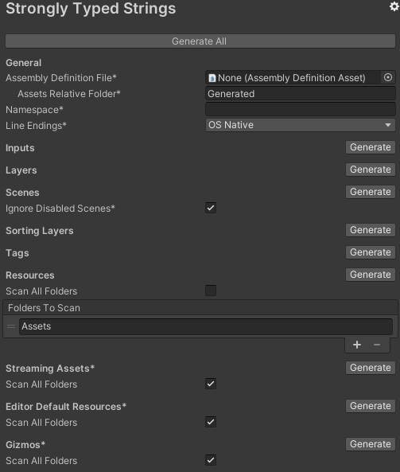

# About Strongly Typed Strings

Use the Strongly Typed Strings package to avoid typos when using standard strings to reference stuff in your code. For example, use Strongly Typed Strings to generate an enum for you project [tags](https://docs.unity3d.com/Manual/Tags.html) or even for the content inside all your [Resources folder](https://docs.unity3d.com/ScriptReference/Resources.html). The Strongly Typed Strings package also includes an easy API that enables you to create your own custom types.

# Installing Strongly Typed Strings

To install this package, follow the instructions in the [Package Manager documentation](https://docs.unity3d.com/Packages/com.unity.package-manager-ui@latest/index.html). 

In addition, you need to go to *Tools > Coimbra > Generate Strongly Typed Strings* to generate the built-in defined types at least once.

# Using Strongly Typed Strings

You can customize the output of this tool - for both built-in types and custom types - by going to `Edit/Project Settings.../Strongly Typed Strings`. There you can also generate only one of the files instead of generating them all at once.

**WARNING**: the generated enums are not guarantee to be serialized always on the same order by Unity so you should not use them to input data though the inspector.


> `*` Settings with tooltips.

There are 2 major features within this package:

- Pre-made strongly-typed strings to replace Unity's strings that references runtime time. To use it just go to `Tools/Generate Strongly Typed Strings` and wait the process to finish. This will generate the following files by default:

  | File | Content |
  | :-- | :-- |
  | `InputType.cs` | Holds the input axes created in Unity's Input menu. You can access the real input name using `InputType.MyInput.GetValue()`. |
  | `LayerType.cs` | Holds the layers created in Unity's Tag and Layers menu. You can access the layer index using `(int)LayerType.MyLayer` or the real layer name using `LayerType.MyLayer.GetValue()`. |
  | `SceneType.cs` | Holds the scenes added to the Unity's Build Settings menu. You can access the scene index using `(int)SceneType.MyScene` or the scene path by using `SceneType.MyScene.GetValue()`. |
  | `SortingLayerType.cs` | Holds the sorting layers created in Unity's Tags and Layers menu. You can access the sorting layer index using `(int)SortingLayerType.MySortingLayer` or the real sorting layer name using `SortingLayerType.MySortingLayer.GetValue()`. |
  | `TagType.cs` | Holds the tags created in Unity's Tags and Layers menu. You can access the real tag name using `TagType.MyTag.GetValue()`. |
  | `ResourceType.cs` | Holds the assets inside the specials `"Resources"` folders. You can access the actual `"Resources`" relative path by using `ResourceType.MyResource.GetValue()`. |
  | `StreamingAssetType.cs` | Holds the assets inside the special `"StreamingAssets"` folders. You can access the actual `"StreamingAssets"` relative path by using `StreamingAssetType.MyAsset.GetValue()`. |
  | `EditorDefaultResourceType.cs` | Holds the assets inside the special `"Editor Default Resources"` folders. You can access the actual `"Editor Default Resources"` relative path by using `EditorDefaultResourceType.MyEditorResource.GetValue()`. |
  | `GizmoType.cs` | Holds the assets inside the special `"Gizmos"` folders. You can access the actual `"Gizmos"` relative path by using `GizmoType.MyGizmo.GetValue()`. |

  Usage example:

  ```c#
  using UnityEngine;

  public class Player : MonoBehaviour
  {
      private void Start()
      {
          gameObject.layer = (int)LayerType.Player;
          gameObject.tag = TagType.Player.GetValue();
      }
  }
  ```

- An easy way to create new custom strongly typed strings for your own use case. You only need to:

  - Inherit from [`GeneratorUnit`](#generatorunit)
  - Add the attribute [`GeneratorExtensionAttribute`](#generatorextensionattribute)
  - Implement the required methods
  - Run the generator in the `Project Settings` or in the `Tools/Coimbra` menu

  Check the sample package **CustomGenerator** for more information.

# Technical details

## Requirements

This version of Strongly Typed Strings is compatible with the following versions of the Unity Editor:

* 2019.3 and later (recommended)

## Known limitations

Strongly Typed Strings version 2.0 includes the following known limitations:

* The generated enums are not safe for serialization as their order may change each time you run the generator
* You must manually run the generator each time you make modifications that should affect the generated types

## Document revision history
 
|Date|Reason|
|---|---|
|March 1, 2020|Document created. Matches package version 2.0.|
